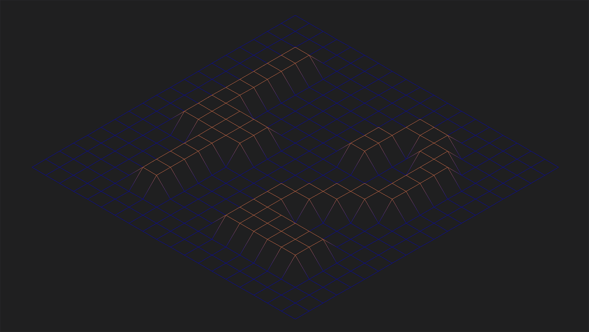

<p align="center">


</p>

# FDF

- [ ] Executable must be named FDF
- [ ] must use miniLibX
  - if from sources, need to apply the same rules for your libft
- allowed functions
  - open, read, write, close
  - malloc, free
  - perror, strerror
  - exit
  - all functions defined in *math* library
  - all the functions defined in miniLibX library
  - other functions are allowed to complete the bonus part as long as
    their use is justified during evaluation
- creating a "wireframe" ("fils de fer") representation of a landscape
- coordinates are stored in a file passed as a parameter to your program

``` bash
$>cat 42.fdf
0 0 0 0 0 0 0 0 0 0 0 0 0 0 0 0 0 0 0
0 0 0 0 0 0 0 0 0 0 0 0 0 0 0 0 0 0 0
0 0 10 10 0 0 10 10 0 0 0 10 10 10 10 10 0 0 0
0 0 10 10 0 0 10 10 0 0 0 0 0 0 0 10 10 0 0
0 0 10 10 0 0 10 10 0 0 0 0 0 0 0 10 10 0 0
0 0 10 10 10 10 10 10 0 0 0 0 10 10 10 10 0 0 0
0 0 0 10 10 10 10 10 0 0 0 10 10 0 0 0 0 0 0
0 0 0 0 0 0 10 10 0 0 0 10 10 0 0 0 0 0 0
0 0 0 0 0 0 10 10 0 0 0 10 10 10 10 10 10 0 0
0 0 0 0 0 0 0 0 0 0 0 0 0 0 0 0 0 0 0
0 0 0 0 0 0 0 0
```

| y   | x-\> | 0   | 1   | 2   | 3   | 4   | 5   | 6   | 7   | 8   | 9   | 10  | 11  | 12  | 13  | 14  | 15  | 16  | 17  | 18  |
|-----|------|-----|-----|-----|-----|-----|-----|-----|-----|-----|-----|-----|-----|-----|-----|-----|-----|-----|-----|-----|
|     |      |     |     |     |     |     |     |     |     |     |     |     |     |     |     |     |     |     |     |     |
| 0   |      | 0   | 0   | 0   | 0   | 0   | 0   | 0   | 0   | 0   | 0   | 0   | 0   | 0   | 0   | 0   | 0   | 0   | 0   | 0   |
| 1   |      | 0   | 0   | 0   | 0   | 0   | 0   | 0   | 0   | 0   | 0   | 0   | 0   | 0   | 0   | 0   | 0   | 0   | 0   | 0   |
| 2   |      | 0   | 0   | 10  | 10  | 0   | 0   | 10  | 10  | 0   | 0   | 0   | 10  | 10  | 10  | 10  | 10  | 0   | 0   | 0   |
| 3   |      | 0   | 0   | 10  | 10  | 0   | 0   | 10  | 10  | 0   | 0   | 0   | 0   | 0   | 0   | 0   | 10  | 10  | 0   | 0   |
| 4   |      | 0   | 0   | 10  | 10  | 0   | 0   | 10  | 10  | 0   | 0   | 0   | 0   | 0   | 0   | 0   | 10  | 10  | 0   | 0   |
| 5   |      | 0   | 0   | 10  | 10  | 10  | 10  | 10  | 10  | 0   | 0   | 0   | 0   | 10  | 10  | 10  | 10  | 0   | 0   | 0   |
| 6   |      | 0   | 0   | 0   | 10  | 10  | 10  | 10  | 10  | 0   | 0   | 0   | 10  | 10  | 0   | 0   | 0   | 0   | 0   | 0   |
| 7   |      | 0   | 0   | 0   | 0   | 0   | 0   | 10  | 10  | 0   | 0   | 0   | 10  | 10  | 0   | 0   | 0   | 0   | 0   | 0   |
| 8   |      | 0   | 0   | 0   | 0   | 0   | 0   | 10  | 10  | 0   | 0   | 0   | 10  | 10  | 10  | 10  | 10  | 10  | 0   | 0   |
| 9   |      | 0   | 0   | 0   | 0   | 0   | 0   | 0   | 0   | 0   | 0   | 0   | 0   | 0   | 0   | 0   | 0   | 0   | 0   | 0   |
| 10  |      | 0   | 0   | 0   | 0   | 0   | 0   | 0   | 0   | 0   | 0   | 0   | 0   | 0   | 0   | 0   | 0   | 0   | 0   | 0   |

# Important!!!

- use libft (get_next_line, ft_split)
- file will be properly formatted
- fdf has to show the map using isometric projection
- must be able to quit program by pressing 'esc'
- use of images from minilibX is not required to validate project, but
  it's encouraged to use them
